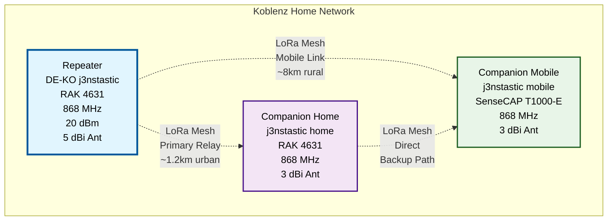

My activities around Meshcore LoRa mesh networking and Meshtastic projects.

## Overview

This page documents my projects, tests, and experiences with Meshcore and Meshtastic devices.

## Current Projects

### Home-Setup
**Description:**  
My current *Meshcore* setup at Koblenz. 

**Status:** Running

**Technical Details:**
| Parameter | Value |
|-----------|-------|
| Frequency | 868 MHz |
| Firmware  | v1.14.1 |

## Hardware Setup

Network Overview

- Repeater: 
    - Name: [DE-KO j3nstastic](https://www.bytehero.io/posts/2026/meshcore-repeater-rak4631/)
    - Model: RAK 4631
- Companion #1 
    - Name: j3nstastic home
    - Model: RAK 4631
- Companion #2 
    - Name: j3nstastic mobile
    - Model: SenseCAP T1000-E

## Related posts

All [Meshcore & Meshtastic posts](/tags/lora/) (auto-generated list)

## Resources

- [Meshcore Documentation](https://github.com/meshcore-dev/MeshCore/blob/main/docs/faq.md)
- [Meshtastic Documentation](https://meshtastic.org/docs/)

## Contact

Questions about Meshcore/Meshtastic?  
Feel free to contact me at ***hello[at]bytehero.io***
