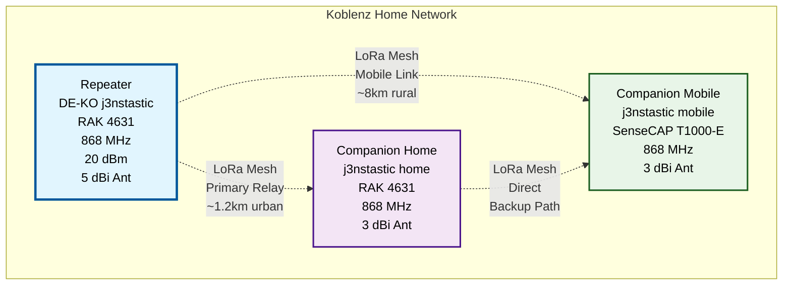

My activities around Meshcore LoRa mesh networking and Meshtastic projects.

## Overview

This page documents my projects, tests, and experiences with Meshcore and Meshtastic devices. Meshcore is a lightweight alternative focused on secure, encrypted text messaging with efficient LoRa routing. Meshtastic is an open-source project that turns affordable LoRa radios into a decentralized mesh network for off-grid communication. 

### Meshcore Overview
Meshcore is a multi-platform system for encrypted LoRa communication, optimized for off-grid scenarios, emergencies, outdoor activities, and IoT sensors. Unlike Meshtastic's flood routing, it uses structured repeaters for more efficient multi-hop forwarding and offers precise delivery confirmations. It integrates easily with common hardware through a web-flasher and works purely browser-based without internet.

### Meshtastic Overview
Meshtastic leverages LoRa technology to relay messages across a mesh network, where devices forward signals to achieve kilometers of range—perfect for areas without internet or cellular coverage. The firmware runs on devices like Heltec or Lilygo boards, connects via Bluetooth or WiFi to apps, and supports up to 100 nodes per network. It's community-driven and license-free in most regions.

## Current Projects

### Home-Setup
**Description:**  
My current *Meshcore* setup in Koblenz. 

**Status:** Running

**Technical Details:**
| Parameter | Value |
|-----------|-------|
| Frequency | 868 MHz |
| Firmware  | v1.14.1 |

#### Hardware Setup

Network Overview

- Repeater: 
    - Name: [DE-KO j3nstastic](https://www.bytehero.io/posts/2026/meshcore-repeater-rak4631/)
    - Model: RAK 4631
- Companion #1 
    - Name: j3nstastic home
    - Model: RAK 4631
- Companion #2 
    - Name: j3nstastic mobile
    - Model: SenseCAP T1000-E

## Offsite Setup
My Meshcore Repeater in Bad Camberg.

## Related posts

All [Meshcore & Meshtastic posts](/tags/lora/) (auto-generated list)

## Resources

- [Meshcore Documentation](https://github.com/meshcore-dev/MeshCore/blob/main/docs/faq.md)
- [Meshtastic Documentation](https://meshtastic.org/docs/)

## Contact

Questions about Meshcore/Meshtastic?  
Feel free to contact me at ***hello[at]bytehero.io***

Or join me on my Matrix Rooms: 
- [Meshcore Koblenz](https://matrixrooms.info/room/meshcore-koblenz:bytehero.io)
- [Meshtastic Koblenz](https://matrixrooms.info/room/meshtastic-koblenz:bytehero.io)